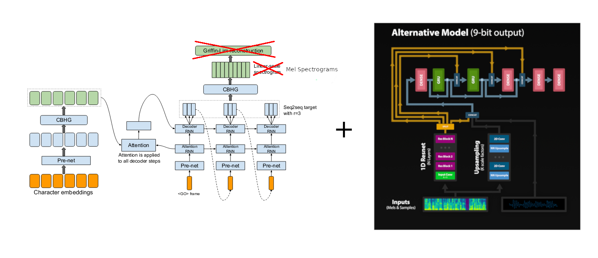

# AI enabled blinds seeing by hearing
## Introduction
According to Gloabl Data on Visual Impairments report, World Health Organization, there are at least 2.2 billion people having a vision impairment, of whom at least 36 million of those were blind, 217 million peeople had moderate to severe visual impairment. The number of blind people increased by 17.6% from 1990 to 2015 (1).

The lose of eye sight makes a lot of challenges to blind people when facing life, such as navigating around places, societal stigma, finding and keeping a job, and enjoying their lives.

Artifical intenlligence (AI) technology is begining to make its way into vision applications in a wide range of industries, expanding on existing capabilities and opening up entirely new possibilities in vision. The rise of computer vision already shows great potential in self-driving vehicles, manufacturing robotics, medical diagnosis, agriculture, and safety surveillance (2).

The intuition of this work is to help blind people to "**see**" by "**hearing**" the world with the state-of-the-art computer vision technique. We developed a **two-step** neural network, first transfer an **image into a textual description**, then **transfer this caption into an audio clip**, speaking out for the blind people to hear. By deploying this algorithm to a live video, we can hearing, in real time, what is happening right in front of the camera.

## Step 1: Image to text captioning
This Encoder-Decoder model can generate a descriptive cation for an image.

*Note: our image captioning model is based on the [Show, Attend, and Tell](https://arxiv.org/abs/1502.03044) paper and this [implementation](https://github.com/sgrvinod/a-PyTorch-Tutorial-to-Image-Captioning)*

#### Encoder
This encoder encodes an image with 3 color channels into a smaller image with learned channels. We choose **ResNet-101** network trained on the ImageNet classification task. The final encoding has a size of 14 by 14 with 2048 channels.

#### Decoder
Decoder use the encoded image and generate a caption word by word. We use an LSTM network with **Attention**, which the decoder will be able to look at defferent parts of the image at different points in the sequence. The Attention network computes the weighted average across all pixels, with important pixels being greater, indicating the region to generate the next word.

## Step 2: Text to speech
This network transfers the caption from Step 1 into an audio clip

*Note: our text-to-speech model is based on Deepmind's WaveRNN from [Efficient Neural Audio Synthesis](https://arxiv.org/abs/1802.08435v1) and this [implementation](https://github.com/fatchord/WaveRNN)*

## Quick Start
fsdaf

## Outlook
#### 1. Real-time processing
The current processing speed from an image to an anduio clip is around 4 second, based on an AMD 3700X CPU and Titan Xp GPU. Ultrimate goal for real-world application is to apply this model to light-weight mobil systems, such as smart phones and NVIDIA Jetson Nano Developer Kit.
#### 2. Nevigation for blinds
Nevigating blind people is one of the most desired function. Our current model shows ability to recognize the world in more general purpose, in the following version, a fork model will be provided focusing on gevigating blind people from A to B. 
#### 3. Smart suggestions
Our current version focuses on *knowing* what is happenning, but not *understanding* what is happenning. In our next version, our model will show ability to providing smart suggestions to blind people based on real-time scenes.

## References 
1. Bourne RRA, Flaxman SR, Braithwaite T, Cicinelli MV, Das A, Jonas JB, et al.; Vision Loss Expert Group. Magnitude, temporal trends, and projections of the global prevalence of blindness and distance and near vision impairment: a systematic review and meta-analysis. Lancet Glob Health. 2017 Sep;5(9):e888–97.
2. Christian Szegedy, Vincent Vanhoucke, Sergey Ioffe, Jon Shlens, Zbigniew Wojna; Proceedings of the IEEE Conference on Computer Vision and Pattern Recognition (CVPR), 2016, pp. 2818-2826
